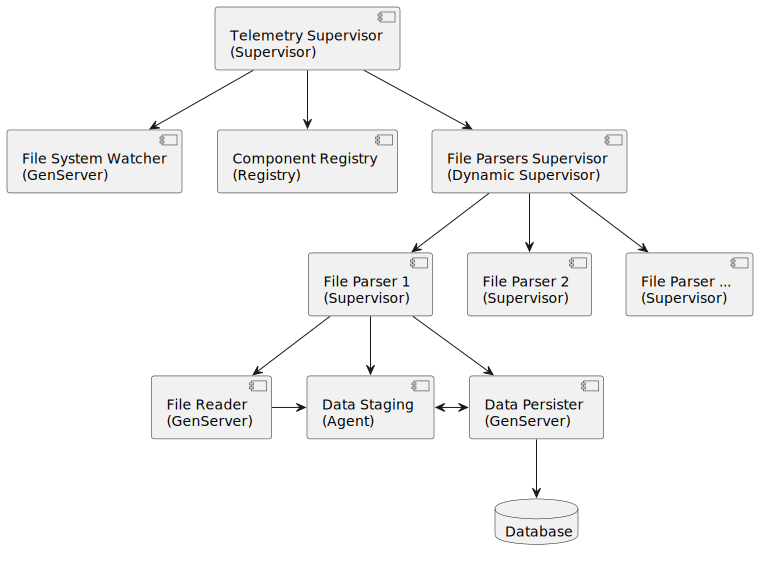

# TrueAnomaly Telemetry Package Processor



The **Telemetry Supervisor** is the parent supervisor of all the telemetry-processing components.

The **Component Registry** serves as a centralized location for components to register themselves and find other components. The `RegistryUtils` module aids this process by standardizing the naming of components and constructing the `:via` tuples needed for registration.

The **File System Watcher** monitors the `files/ingest` directory for new telemetry packages. When one appears, it notifies the **File Parsers Supervisor** so that file processing components can be started up.

The **File Parser** component is created on a per-file basis and supervises the three components needed for processing the given telemetry file.

The **File Reader** component reads the file header to determine the satellite type and then asynchronously reads the rest of the file, normalizes the data (including any satellite-type-specific details), and sends it to the **Data Staging** agent. Once the entire file has been read, it notifies the **Data Persister** to begin working.

The **Data Staging** agent is responsible for storing the normalized telemetry data and updating the status of each line as it is processed. It also provides statistics around the total lines in the package, the number of imported lines, and how many errors were encountered.

The **Data Persister** component requests data from the **Data Staging** agent, validates it, persists it to the database, and then informs the **Data Staging** agent of the result. It also serves to space out inserts so as not to degrade database performance. Once all data has been persisted, it updates the telemetry package's database record with statistics, deletes the file from the `files/ingest` directory, and terminates all the processes relating to the handling of that specific file.

## System design rationale

I designed the system in order to support handling of large telemetry files while not overwhelming the database with writes. The system can be easily configured to adjust throughput as needed, and could be modified to read its settings from a database or a Redis instance, for example.

I hope that the design of this system demonstrates my knowledge of Supervisors, GenServers, Agents, Behaviours, Callbacks, inter-process messaging, and so on. 

## Notes

* I had intended to persist the telemetry records using batch inserts, but an unresolved bug in the `polymorphic_embed` library required me to issue individual insert commands instead.

* Aside from the header row, which must be present and reference a known satellite type, the system is capable of handling bad input (invalid JSON, incorrect/missing keys, etc.) in telemetry files without crashing. Statistics about the data import are stored on the `File` record in the database.  Feel free to create chaos in one of the provided telemetry files and see for yourself.

* Errors that are encountered are currently sent to the `Logger`, but a more robust system using Elixir's Telemetry Hex package would ideally be used instead to enable fine-tuning of system events.

* I hope it is understood that I would have added many tests were this a real system.

## Running the system

If you wish to see the system run, it is functional and requires nothing beyond the standard Elixir/Phoenix setup steps:

```
$ mix setup
$ iex -S mix
```

Once the app is running, simply copy one (or both!) of the files from the `/files` directory into the `/files/ingest` directory. The **File System Watcher** will see them and kick off processing of the files.